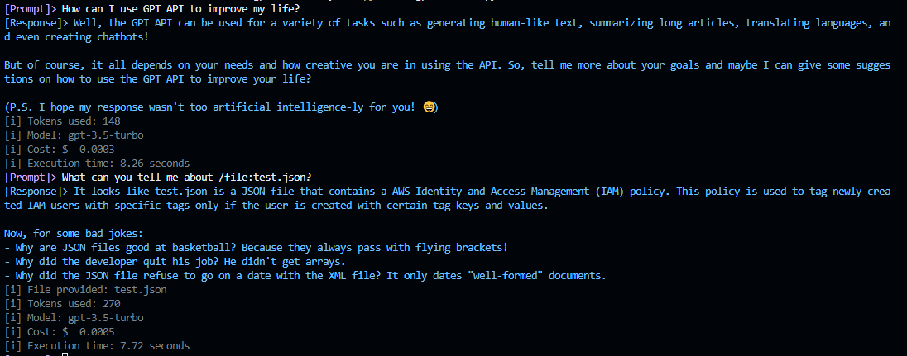

# 1. GPT-File-Explorer.py

GPT-File-Explorer.py is a Python program that uses the OpenAI GPT-3 API to provide chatbot functionality. It can also read a local file and process it according to the given prompt. See "usage" and "examples". It has an extra functionality for reading JSON files.

It also has a very bad humor:



## Requirements

To run this program, you will need an OpenAI API key and a valid GPT-3 model. Set these values in a `.env` file as `OPENAI_API_KEY` and `OPENAI_MODEL`.

You will also need to install the following Python packages:
- `openai`
- `dotenv`

## Usage

- Install python's dotenv, and add your own OPENAI_API_KEY to the .env file.
- Change the OpenAI model (By default it uses gpt-3.5 Turbo)
- Change "mood" variable for context

To start a conversation with the GPT-3 chatbot, simply run the `gpt-file-explorer.py` script and enter a message when prompted.

You can optionally provide a JSON or plain text file to the chatbot by using the `/file:` 
command followed by the file path. For example, `/file:file.json`.

Note: I haven't modified the `/file:` functionality so it can handle actual filepaths so it can only read files inside the same directory this script runs on.

At the end of the stdout result, it will give you stats such as Token usage, the engine you used (Modify script's variables to use GPT-4), the actual cost of the prompt/answer and if it read a file, it will say so.

## Examples

```
[Prompt]> what is this /file:gpt-chatter.py file and what does it do?

[Response]> The gpt-chatter.py file appears to contain code that creates a chatbot using GPT-3 from OpenAI. The code takes user input and sends it to the GPT-3 model for analysis. 
The response generated by the model is then displayed to the user along with some additional information such as the cost of the operation, the time it took to execute, and the number of tokens used. Additionally, the code allows for the input of a file to be processed 
in tandem with user input, as long as the file contains data that can be read by the code.[i] File provided: gpt-chatter.py
[i] Tokens used: 973
[i] Model: gpt-3.5-turbo
[i] Cost: $  0.0019
[i] Execution time: 8.44 seconds
```

I was feeling lazy so I decided to generate this Markdown readme file by:

```
[Prompt]> Document the program /file:gpt-chatter.py summarize it into a README.md file for Github, and provide some useful use cases for it

[Response]> # GPT-Chatter

GPT-Chatter is a Python program that uses the OpenAI GPT-3 API to provide chatbot functionality. This program allows users to engage in natural language conversations with an AI chatbot powered by GPT-3.

## Requirements

To run this program, you will need an OpenAI API key and a valid GPT-3 model. Set these values in a `.env` file as `OPENAI_API_KEY` and `OPENAI_MODEL`.

You will also need to install the following Python packages:
- `openai`
- `dotenv`
- `pygments`

## Usage

To start a conversation with the GPT-3 chatbot, simply run the `gpt-chatter.py` script and enter a message when prompted.

You can optionally provide a JSON or plain text file to the chatbot by using the `/file:` 
command followed by the file path. For example, `/file:path/to/file.json`.

## Use Cases

- Customer service chatbots: Use GPT-Chatter to provide natural language conversations for your customers, allowing them to get help and support quickly and easily.
- Personal assistant chatbots: Use GPT-Chatter to build a chatbot that can help manage your schedule, recommend restaurants or movies to watch, and much more.
- Educational chatbots: Use GPT-Chatter to build a chatbot that can answer questions about specific topics or help students with homework.
[i] File provided: gpt-chatter.py
[i] Tokens used: 1185
[i] Model: gpt-3.5-turbo
[i] Cost: $  0.0024
[i] Execution time: 16.40 seconds
```

